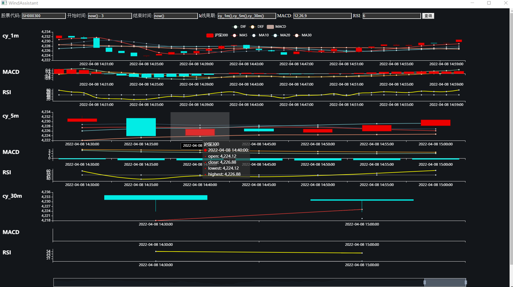

# WindAssistant

## 介绍

盘中股票数据实时监控工具。可根据需求打造更灵活的监控看板。

## 数据
1. 开通天软账户，见其官网。[tinysoft](http://www.tinysoft.com.cn/TSDN/HomePage.tsl)
2. [安装pyTSL包](http://py3k.cn/pyTSL/setup.html)，用于天软和Python交互。
3. 创建并配置`TSlogin.ini`文件, 请参考[pytsl-client部分的说明](http://py3k.cn/pyTSL/usage.html#pytsl-client)

## 部署为exe可执行文件
可以使用[pyinstaller](https://pypi.org/project/pyinstaller/)打包为可执行文件。避坑指南如下：
1. 确保处于全英文目录下
2. 打开`Anaconda Peompt`, 利用cd命令跳转到根目录。
3. 运行`pyinstaller WindAssistant.py --hidden-import 'talib.stream'`
4. 运行结束后，找到`.\dist\WindAssistant`文件夹，然后放入本仓库中的templates文件夹。
5. 复制`.\dist\WindAssistant\PyQt5\Qt5\bin\QtWebEngineProcess.exe`，粘贴到`.\dist\WindAssistant`目录下。
6. 运行`.\dist\WindAssistant\WindAssistant.exe`, 应该可以正常使用。

## 怎么做出来的
**数据获取与处理。** 围绕天软数据库Python接口自定义了代码简洁、可复用的模组，并据此实现后续的数据获取、清洗、加工等环节；

**绘图、实时更新。** 基于HTML与JavaScript制作可视化界面。前端主要用Charts库接口制作可交互图表、用jQuery库定时刷新界面；后端基于自制模组响应刷新需求，按需求分析行情数据，并通过多线程机制避免因进程阻塞而操作卡顿。

**交互界面封装。** 通过PyQt5实现交互界面，提高使用体验。

